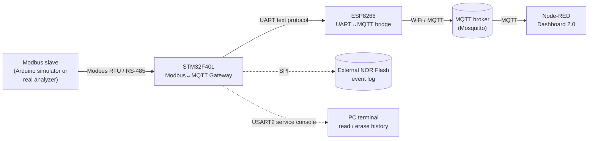
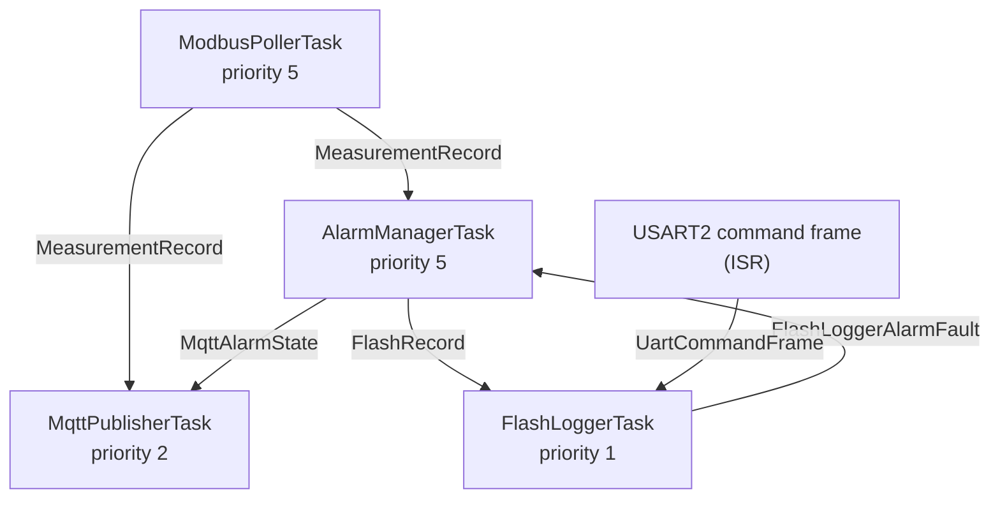

# Industrial Modbus → MQTT Gateway

A bare-metal STM32 + FreeRTOS gateway that polls a Modbus RTU slave device
(e.g. a network parameter analyzer), evaluates the readings against
configurable alarm thresholds, persists alarm-triggering events to external
SPI Flash, and republishes everything over a lightweight text protocol to an
ESP8266 bridge, which turns it into MQTT for a Node-RED dashboard.

This repository contains the full chain: the STM32 firmware, an Arduino
Modbus-slave simulator used for development and testing, the ESP8266
UART↔MQTT bridge, and a description of the Node-RED dashboard that
visualizes it all.

## About this project

This is a self-directed learning project built while transitioning from
electrical/mechatronics engineering into embedded systems. The STM32
firmware is hand-written C, built specifically to practice FreeRTOS,
peripheral drivers (UART/DMA, SPI), and defensive protocol design. The
Arduino simulator and ESP8266 bridge exist to make the STM32 firmware
testable and demoable without needing a real Modbus analyzer on a bench —
they're a supporting cast, not the focus of the exercise.

## Table of contents

- [System overview](#system-overview)
- [Repository structure](#repository-structure)
- [STM32 Modbus↔MQTT Gateway](#stm32-modbusmqtt-gateway)
- [Arduino Modbus slave simulator](#arduino-modbus-slave-simulator)
- [ESP8266 UART↔MQTT bridge](#esp8266-uartmqtt-bridge)
- [Node-RED dashboard](#node-red-dashboard)
- [Communication protocols reference](#communication-protocols-reference)
- [Notable engineering decisions](#notable-engineering-decisions)
- [Getting started](#getting-started)
- [Testing & validation](#testing--validation)
- [Known limitations & roadmap](#known-limitations--roadmap)
- [License](#license)

## System overview



Data flows in one direction end to end (slave → gateway → bridge → broker →
dashboard), with two side channels on the STM32: a persistent event log on
external Flash, and a service console over a second UART for reading or
erasing that log without touching the main data path.

## Repository structure

```
.
├── Core/                       # STM32 firmware (STM32CubeIDE project)
│   ├── Inc/                    # Headers
│   └── Src/                    # Source
├── arduino-modbus-simulator/   # Arduino sketch simulating the Modbus slave
├── esp8266-mqtt-bridge/        # ESP8266 UART↔MQTT bridge firmware
└── node-red-dashboard/         # Node-RED flow export for the dashboard
```

> Adjust the paths above to match how the files actually end up organized in
> this repository — the STM32 firmware is confirmed under `Core/`; the other
> three folders are a suggested layout for the companion pieces.

## STM32 Modbus↔MQTT Gateway

The core of the project. Runs on an STM32F401 (Nucleo-64 form factor),
clocked at 84 MHz, on FreeRTOS v10.3.1 with **fully static allocation** — no
heap fragmentation risk, every task/queue/semaphore's memory footprint is
known at compile time.

### Responsibilities

- Poll a Modbus RTU slave once per second for three holding registers
  (voltage, current, temperature).
- Apply per-channel alarm thresholds with hysteresis, so a value that just
  crosses back over the boundary doesn't immediately clear the alarm.
- Drive four status LEDs reflecting normal/measurement-alarm/
  communication-fault/storage-fault state.
- Log every alarm state *transition* (not every sample) to external SPI NOR
  Flash as a CRC16-protected, timestamped record.
- Republish the live measurement and any alarm state change over a second
  UART, in a compact text protocol meant to be trivial for a
  network-connected microcontroller (the ESP8266) to parse.
- Serve two service commands over a third UART (`read <n>`, `erase
  history`) to inspect or clear the Flash log without needing to pull the
  Flash chip or reflash the firmware.

### FreeRTOS task architecture



| Task | Priority | Role |
|---|---|---|
| `ModbusPollerTask` | 5 | Polls the slave every 1 s, publishes the result to both `AlarmManagerTask` and `MqttPublisherTask`. |
| `AlarmManagerTask` | 5 | Applies hysteresis, drives the alarm LEDs, builds the Flash record and the MQTT alarm event. |
| `MqttPublisherTask` | 2 | Formats and sends the UART6 text frames consumed by the ESP8266. |
| `FlashLoggerTask` | 1 | Owns the external Flash: writes new records, and serves `read`/`erase` commands from the service console. Lowest priority on purpose — a Flash erase can take up to ~200 s and must never hold up real-time polling or alarm handling. |

All inter-task communication goes through FreeRTOS queues, sized around one
of two patterns: length-1 queues carrying "the latest state" (written with
`xQueueOverwrite`, since only the newest value matters to the consumer), and
a length-5 queue for the Flash event log (written with a non-blocking
`xQueueSend`, since an alarm event that can't be logged right now should be
dropped rather than stall alarm/LED/MQTT handling).

### External Flash event log

An external SPI NOR Flash chip (16 MB, standard JEDEC command set — Write
Enable, Read Status Register, JEDEC ID, Read/Page Program/Sector Erase/Chip
Erase) stores a linear, append-only log of 20-byte records:

```c
typedef struct {
    float voltage;
    float current;
    float temperature;
    uint32_t timestamp_ms;   // FreeRTOS tick count at time of logging
    uint8_t trigger_channel; // bitmask: which channel(s) changed state
    uint16_t crc;            // CRC16 over everything before this field
} FlashRecord_t;
```

Records are only written on an alarm state **transition**, not on every
sample — a communication fault or an out-of-range measurement gets logged
once when it starts and once when it clears, not every second it persists.
The write position survives a reset by re-scanning the Flash on boot (an
accepted one-time startup cost — see [Known limitations](#known-limitations--roadmap)).
A full log blocks further automatic writes (`STORAGE_FAULT`) until an
explicit `erase history` command is issued over the service console.

### Alarm thresholds

| Channel | Normal range | Hysteresis band |
|---|---|---|
| Voltage | 207 – 253 V | ±1 V |
| Current | 0 – 25 A | ±0.5 A |
| Temperature | 10 – 45 °C | ±1 °C |

### Status LEDs and debug UART

| Signal | Pin | Meaning |
|---|---|---|
| `ALARM_NORMAL` | PB15 | Lit when everything is within range and Flash logging is healthy. |
| `ALARM_MEASUREMENT` | PB14 | Lit when any measurement channel is out of range. |
| `ALARM_COMMUNICATION` | PB13 | Lit on a Modbus communication fault, or a temporary Flash communication fault. |
| `ALARM_STORAGE_FAULT` | PC6 | Lit when the Flash log is full or has a persistent fault. |
| `LD2` | PA5 | Reserved exclusively for fault signalling: blinks at ~1 Hz if `Error_Handler()` is reached, lit solid on a FreeRTOS stack overflow. Not used for anything else in the firmware. |

`USART2` doubles as the service console (via the ST-Link virtual COM port):
it accepts `read <n>` / `erase history` commands and also carries
diagnostic messages (`Error_Handler()` notifications, stack overflow
reports, Flash status messages).

`USART1` (RS-485/Modbus) and `SPI2` (external Flash) pin assignments are
configured via STM32CubeMX and aren't reproduced here — check `usart.c` /
`spi.c` or the project's `.ioc` file for the exact pinout on your board.

## Arduino Modbus slave simulator

A Modbus RTU slave sketch (built on the `ModbusRTUSlave` library) that
stands in for a real network parameter analyzer during development. Rather
than just serving static numbers, it:

- Drifts voltage, current, and temperature with a bounded random walk each
  second, so the gateway sees continuously changing, plausible-looking data
  instead of a frozen value.
- Pulls temperature gently back toward a 25 °C baseline every step
  (proportional to how far it has wandered), so it spends most of its time
  in a realistic band while still occasionally drifting into the STM32's
  alarm range — modeling both normal seasonal variation and genuine
  overheating events, not just the scripted incidents below.
- Randomly triggers one of two scripted incidents (~once every 2.5 minutes
  on average): a **voltage loss** (voltage and current both drop to zero
  for several samples) or an **overcurrent trip** (one sample well above
  the alarm threshold, simulating a breaker tripping, followed by zero
  current as if the circuit is now open).

This turns the gateway's alarm and hysteresis logic into something that can
be exercised continuously and unattended, rather than requiring manual
fault injection for every test.

## ESP8266 UART↔MQTT bridge

The STM32 has no WiFi or MQTT stack of its own by design — it only speaks a
small custom text protocol over UART. This ESP8266 firmware is the only
part of the system that understands MQTT; its job is narrow on purpose:
read a line of text from the STM32, and turn it into a PUBLISH.

Notable design points:

- **Non-blocking WiFi/MQTT reconnect.** Both connections are re-established
  using a `millis()`-based retry timer rather than a blocking
  `while (!connected) { delay(...); }` loop, so the UART read in `loop()`
  keeps running even while the network is down — the STM32 doesn't know or
  care whether WiFi is up, and keeps sending frames regardless.
- **Last Will and Testament.** Registered at MQTT connect time on the
  `project/status` topic, so if the ESP8266 ever disappears without a clean
  disconnect (power loss, crash, WiFi black hole), the *broker itself*
  publishes "offline" on its behalf.
- **Deliberate retained/not-retained choices per topic** — see the
  [MQTT topics table](#mqtt-topics) below.

## Node-RED dashboard

Built on Node-RED Dashboard 2.0, subscribing to all four MQTT topics:

- **Live measurements** — one `mqtt in` on `project/measurements`, parsed as
  JSON, feeding both numeric gauges and text widgets for voltage, current,
  and temperature.
- **Alarm state** — one `mqtt in` on `project/events`, feeding a
  human-readable alarm sentence (e.g. *"SPI communication fault +
  measurement out of range"*, or *"All systems normal"*) and three
  individual LEDs (`@flowfuse/node-red-dashboard-2-ui-led`) for
  voltage/current/temperature, each changing color only when that specific
  channel's state actually changes. LEDs are initialized to green on
  Node-RED startup so they never sit gray/unset before the first event.
- **Link status** — `mqtt in` on `project/status`, feeding an ONLINE/OFFLINE
  text and LED, so it's immediately obvious whether the numbers on screen
  are live or leftover from before the ESP8266 disappeared.
- **Errors** — a plain, always-visible text widget on `project/errors` (no
  modal popups — deliberately judged disproportionate for how rarely this
  fires).

Matching text/LED pairs sit side by side in the same dashboard group;
`debug` nodes are attached to the key `mqtt in` nodes as a standing
diagnostic point. The whole chain was exercised end to end using the
Arduino incident generator cycling through every voltage/current/
temperature alarm combination, rather than relying only on one-off manual
tests.

## Communication protocols reference

### Modbus register map

Slave ID `0x01`, function code `0x03` (Read Holding Registers), 3 registers
starting at address `0x0000`. All three are `uint16_t`, scaled ×10.

| Register | Address | Value | Example |
|---|---|---|---|
| 0 | `0x0000` | Voltage (V ×10) | `2301` → 230.1 V |
| 1 | `0x0001` | Current (A ×10) | `0160` → 16.0 A |
| 2 | `0x0002` | Temperature (°C ×10) | `0250` → 25.0 °C |

### STM32 → ESP8266 UART text protocol

Comma-separated, newline-terminated:

```
M,V=<voltage>,I=<current>,T=<temperature>
E,[SPI=<COMMUNICATION|STORAGE>,]S=<NORMAL|MEASUREMENT|COMMUNICATION>[,<channel>=<IN|OUT>...]
```

- `M` frames carry the live measurement, sent roughly once per second.
- `E` frames carry an alarm state change: `SPI=...` only appears when
  there's an active Flash fault, and any number of `<channel>=IN|OUT` pairs
  (`V`, `I`, `T`) can follow depending on how many channels changed.

### MQTT topics

| Topic | Payload | Retained | Purpose |
|---|---|---|---|
| `project/measurements` | JSON, `{"voltage":..,"current":..,"temperature":..}` | No | Live values, ~1/s. A stale measurement is worse than a missing one, and a fresh one is always ~1 s away. |
| `project/events` | JSON, mirrors the `E` frame's fields | Yes | So a dashboard that connects (or reconnects) late sees the current alarm state immediately, not a blank panel. |
| `project/status` | `"online"` / `"offline"` | Yes (via LWT) | Lets any subscriber distinguish "this data is live" from "this is whatever was last seen before the bridge disappeared". |
| `project/errors` | Plain text | No | Best-effort diagnostics for frames that failed to parse. |

### Service console commands (USART2)

| Command | Effect |
|---|---|
| `read <n>` | Sends the newest `n` (capped at 20) Flash log records over the same UART, newest first. |
| `erase history` | Erases the entire Flash chip and resets the write position to the start of the log. Takes up to ~200 s. |

## Notable engineering decisions

A few choices worth calling out explicitly, since they're the kind of
reasoning that doesn't show up just from reading the code:

- **Semaphores over busy-waiting for every blocking wait.** Every point
  where the firmware waits on something external (a Modbus response, a
  Flash program/erase operation finishing) uses `xSemaphoreTake` /
  `vTaskDelay` rather than a tight polling loop on `HAL_GetTick()`. This
  matters for two reasons: it lets FreeRTOS actually put the waiting task
  to sleep (freeing the CPU for lower-priority tasks instead of starving
  them), and it's simply the idiomatic way to synchronize an ISR with a
  task in FreeRTOS.
- **A snapshot buffer for the Modbus receive path.** DMA re-arms for the
  next frame immediately after each response is received, before the task
  has necessarily finished reading it. The ISR copies the frame into a
  separate snapshot buffer before re-arming DMA, so the task always
  validates a copy that nothing else can overwrite mid-read — closing a
  narrow but real race window on a noisy or shared RS-485 bus.
- **Explicit timeouts on every wait, including hardware flag polling.**
  Even the UART "transmission complete" flag wait has a timeout, not just
  the higher-level Modbus response wait — a hardware fault that never sets
  that flag would otherwise hang the polling task permanently, with no way
  to recover short of a reset.
- **A compile-time guard against silent Flash record corruption.** The
  Flash log reader copies `FlashRecord_t` in one `memcpy` rather than
  field-by-field at fixed byte offsets, and a `_Static_assert` next to the
  struct definition ties its size to the on-disk record size — so a future
  change to the struct fails the build instead of silently misreading
  historical data.
- **Priority assignment reflects real-time importance, not code
  complexity.** Flash logging is the most complex module in the firmware,
  but it runs at the lowest priority (1) precisely because it's allowed to
  take a long time (a full chip erase can take ~200 s) without ever
  blocking Modbus polling or alarm handling, which stay time-critical at
  priority 5.
- **Stage 6 (custom PCB, soldering, real-hardware validation) was
  deliberately deferred**, in favor of finishing and polishing this
  firmware and moving on to further, smaller projects. Getting the RTOS
  usage, protocol handling, and edge cases right on a dev board was judged
  more valuable at this stage than the multi-week detour of a first custom
  PCB layout.

## Getting started

### Hardware

- An STM32F401-based board (Nucleo-64 form factor) with an ST-Link
  debugger.
- An RS-485 transceiver module wired to `USART1` and the `DE_RE_Output`
  pin (`PB12`) for direction control.
- An external SPI NOR Flash chip (any standard JEDEC-command-set device;
  this project was built against a 16 MB part) wired to `SPI2`, with
  `FLASH_CS` on `PC1`.
- An Arduino (or a real Modbus RTU slave device) wired to the RS-485 bus
  for the STM32 to poll.
- An ESP8266 module (e.g. NodeMCU) wired to `USART6` for the MQTT bridge.
- An MQTT broker reachable from the ESP8266's WiFi network (e.g. a local
  Mosquitto instance).
- Node-RED with the Dashboard 2.0 palette and
  `@flowfuse/node-red-dashboard-2-ui-led` installed.

### Firmware

1. Open the STM32 project in STM32CubeIDE (built against FreeRTOS
   v10.3.1). Build and flash via the ST-Link.
2. Flash the `arduino-modbus-simulator` sketch to the Arduino acting as the
   Modbus slave (requires the `ModbusRTUSlave` library).
3. Before flashing the ESP8266 bridge, replace the placeholder WiFi
   credentials and MQTT broker address in the sketch with your own — **do
   not commit real credentials to source control.**
4. Import the Node-RED flow export and point its `mqtt in`/`mqtt out` nodes
   at your broker.
5. Open a serial terminal on the STM32's `USART2` (ST-Link VCP) to watch
   diagnostic messages and issue `read`/`erase history` commands.

## Testing & validation

- FreeRTOS task behavior (state, priority, stack headroom) was inspected
  live via STM32CubeIDE's FreeRTOS-aware debugging (Task List view) over an
  ST-Link/SWD connection, rather than assumed from stack size defines alone.
- The Arduino simulator's scripted incidents were used to drive the full
  alarm/hysteresis/logging/LED/MQTT/dashboard chain through every
  voltage/current/temperature combination unattended, rather than relying
  only on manual, one-off fault injection.
- Edge cases like a hardware fault leaving a status flag permanently unset,
  or a second Modbus frame arriving before the previous one is fully
  processed, were reasoned through and defended against explicitly, not
  just handled for the common case.

## Known limitations & roadmap

- Validated on a dev board with a simulated slave; not yet tested against a
  real physical network parameter analyzer or a custom PCB.
- Flash log timestamps are FreeRTOS tick counts since boot, not
  wall-clock time — there's no RTC on board yet, so historical records lose
  absolute time reference across a reset.
- On a nearly full log, `resolve_data_write_slot()` scans forward through
  Flash sector by sector at boot to find the next write position — a
  one-time startup cost that grows as the log fills up (bounded by the
  Flash's total size), not a per-record cost.
- WiFi/MQTT credentials currently live directly in the ESP8266 source; a
  separate, gitignored secrets file would be a natural next step before
  treating this as anything other than a personal/portfolio project.
- Planned next: a custom PCB and full hardware validation (deliberately
  scoped out of this phase — see
  [Notable engineering decisions](#notable-engineering-decisions)), and
  possibly unit tests for the pure-logic modules (Flash addressing
  arithmetic, alarm hysteresis) that don't depend on STM32 hardware.

## License

Not yet decided. If you're reading this as a portfolio reviewer: treat the
code as "look, don't reuse" until a license is added. (MIT is the likely
candidate for a project like this.)
